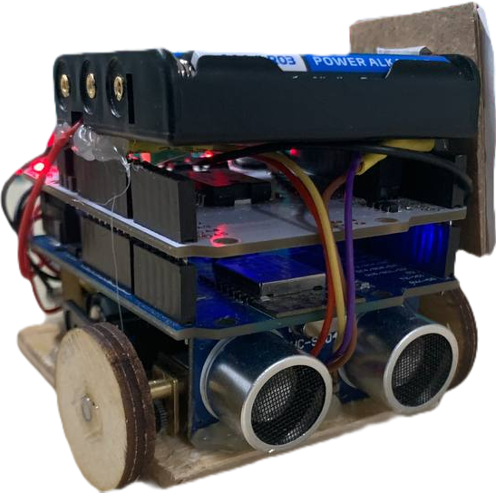
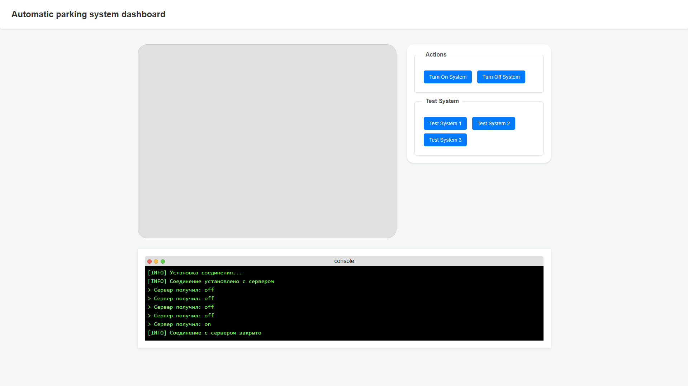

# Automatic Parking System

    
    Данный репозиторий содержит материалы проекта "Модель автоматической парковки", разработанного для участия в Московской предпрофессиональной олимпиаде школьников, профиль "Инженерия".

## Описание проекта

Проект представляет собой программно-аппаратный комплекс (ПАК), реализующий автоматическую парковку модели автомобиля.  Система включает в себя следующие подсистемы:

*   **ПРА (Подсистема распознавания автомобиля):**  Отвечает за идентификацию автомобиля по QR-коду.
*   **ППЯ (Подсистема перемещения ячеек):**  Обеспечивает перемещение ячеек парковки.
*   **ПАУ (Подсистема автоматического управления):**  Координирует работу всех подсистем, управляет процессом парковки и хранения данных.
*   **ПБА (Подсистема беспилотного автомобиля):**  Модель автомобиля, способная к автономному перемещению.

## Внешний вид пользовательского интерфейса

_Предоставлен исключительно для справки, может отличаться_

## Структура репозитория

*   **Программный код:** Исходный код программного обеспечения ПАК.
*   **3D-модели:** Файлы 3D-моделей элементов системы.
*   **Видеоролик:** Ссылка на видеоролик, демонстрирующие работу системы.
*   **Фото:** Фотографии устройства

## Сборка и запуск
1.  Установите необходимые библиотеки: `pip install -r requirements.txt`
2.  Подключите Arduino к компьютеру.
3.  Загрузите скетч `esp.ino` на модуль на основе ESP8266.
4.  Запустите программу: `python main.py`

- Для просмотра модели общей сборки проекта, используйте программу **SolidWorks**

## Команда

*   Еремкин Степан
*   Вершок Владимир
*   Шишкин Степан
*   Брюханов Михаил
*   Пикулин Виктор
*   Руководитель: Шапошников Филипп Владимирович

_Подробное описание проекта, технические характеристики, результаты испытаний и прочая информация содержатся в отчетной документации._
